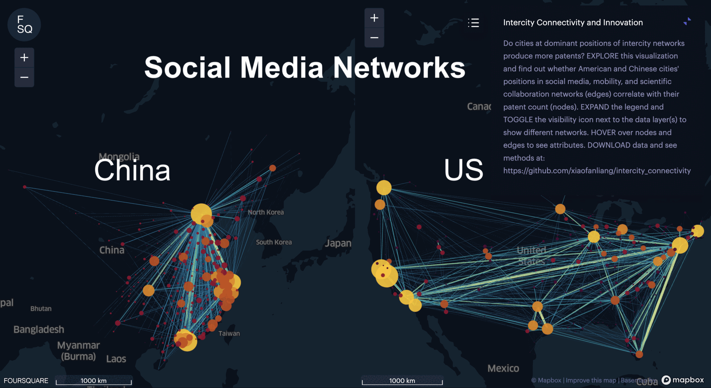

# Intercity Connectivity and Innovation 

[TAKE ME TO THE MAP!](https://xiaofanliang.github.io/intercity_connectivity/)
[TAKE ME TO THE DATA!](https://github.com/xiaofanliang/intercity_connectivity/tree/main/Data)

**Interpret the Vis**: Each node in the network represents a city in China or the U.S. Each edge represents a social media, mobility, or scientific collaboration connection. Node color and size are scaled by the city's patent count. Edge color and size are scaled by the weighted network degree (i.e., number of connections). The vis only shows selected edges above certain weights. 

**Explore the Vis**: EXPAND the legend icon, CONTRACT data layers by network group (e.g., each network will have a point and line layer that are grouped under a network label, such as US Social Media Network), and TOGGLE visibility icon next to different data layers to compare intercity networks. HOVER to individual nodes or edges to see attributes. This visualization is created with Foursquare Studio.  

## Project background

Urban outputs, from economy to innovation, are known to grow as a power of a city’s population. But, since large cities tend to be central in transportation and communication networks, the effects attributed to city size may be confounded with those of intercity connectivity. Here, we map intercity networks for the world’s two largest economies (the United States and China) to explore whether a city’s position in the networks of communication, human mobility, and scientific collaboration explains variance in a city's patenting activity that is unaccounted for by its population. We find evidence that models incorporating intercity connectivity outperform population-based models and exhibit stronger predictive power for patenting activity, particularly for technologies of more recent vintage (which we expect to be more complex or sophisticated). The effects of intercity connectivity are more robust in China, even after controlling for population, GDP, and education, but not in the United States once adjusting for GDP and education. For Chinese cities, social media and mobility networks explain better intercity heterogeneities in the scaling of innovation, whereas for cities in the United States, the scientific collaboration network plays a more significant role. These findings support the significance of a city’s position within the intercity network in shaping its success in innovative activities.

This project is led by [Xiaofan Liang](https://www.xiaofanliang.com/) at University of Michigan - Ann Arbor, [César A. Hidalgo](https://cesarhidalgo.com/) at University of Toulouse, [Pierre-Alexandre Balland](https://www.paballand.com/) at Utrecht University, [Siqi Zheng](https://www.siqizheng.com/) at MIT, and [Jianghao Wang](http://www.lreis.ac.cn/en/People/ARP/202005/t20200519_560151.html) at Chinese Academy of Sciences. 

## Data 
We shared city-level network and socioeconomic attributes for social media, mobility, and scientific collaboration networks in both China and the U.S. The spatial unit is municipal city in China, and Metropolitan Statistical Area in the U.S.

**Social Media Network**: China’s social media network data were collected from Weibo (Chinese Twitter) in 2015. U.S. social media network data comes from Facebook’s publicly available [Social Connectedness Index (SCI)](https://data.humdata.org/dataset/social-connectedness-index?). 

**Mobility Network**: China’s mobility network data were collected from Tencent Map in 2016. U.S. mobility network data comes from the [Multiscale Dynamic Human Mobility Flow Dataset](https://github.com/GeoDS/COVID19USFlows) organized by UW GeoDS Lab, which provides estimations of total population flow between counties based on the SafeGraph data. We use the 2019 weekly flow data (12 months) aggregated to the MSA level. 

**Scientific Collaboration Network**: Both China and the U.S.'s scientific collaboration network data were collected from the Web of Science in 2017. We derive the collaboration network from co-publication (co-authorship) relationships. 

Two datasets are shared for DOWNLOAD: [US_Public.csv](https://github.com/xiaofanliang/intercity_connectivity/blob/main/Data/US_Public.csv) and [CN_Public.csv](https://github.com/xiaofanliang/intercity_connectivity/blob/main/Data/CN_Public.csv). Both datasets are filtered so that cities have information in all attributes. 

**US_Public.csv** contains the following columns for 366 MSAs:

* **msaId**: U.S. Census designated Metropolitan Statistical Area (MSA) ID
* **msaName**: Name of the Metropolitan Statistical Area
* **Lon**: The longitude of a MSA's centroid 
* **Lat**: The latitude of a MSA's centroid
* **Res_pop**: A MSA's resident population collected from U.S. Bureau of Economic Analysis (2019).
* **GDP**: A MSA's GDP collected from U.S. Bureau of Economic Analysis (2019).
* **Bachelor_pct**: A MSA's percentage of population with a Bachelor's degree collected from U.S. Bureau of Economic Analysis (2019).
* **Patent**: Number of patent from PatentViews, aggregated based on inventors' geographic locations (2019). 
* **SM_degree_scaled**: A MSA's total Facebook SM (Social Media) connections (i.e., degree) (2020). Note that this value does not indicate the absolute number of connections to a MSA; it is scaled by Social Connectedness Index and thus preserve the relative strength for mapping purpose. 
* **Mob_degree**: A MSA's total mobility connections (i.e., degree), collected from GeoDS Lab's Multiscale Dynamic Human Mobility Flow Dataset (2019).
* **Pub_degree**: A MSA's total co-publication count (i.e., degree), collected from Web of Science (2019). 

**CN_Public.csv** contains the following columns for 275 cities:

* **cityId**: China Census designated municipal city ID
* **cityName_CN**: Name of a city in Mandarin 
* **cityName_EN**: Name of a city in English  
* **Lon**: The longitude of a city's centroid 
* **Lat**: The latitude of a city's centroid
* **Regis_pop**: A city's registered population collected from China City Statistical Yearbook (2016)
* **Res_pop**: A city's resident population, which is calculated as the sum of Urban District Population and Urban District Temporary Population in China Urban Construction Statistical Yearbook (2016). 
* **GDP**: A city's GDP collected from China City Statistical Yearbook (2016).
* **Employ_pct**: A city's percentage of population employed in information, finance, and research industries collected from China City Statistical Yearbook (2016); this is used to approximate the percentage of population with a Bachelor's degree. 
* **Patent**: A city's number of patent from China National Intellectual Property Administration (2017). 
* **SM_degree**: A city's number of social media connections (i.e., degree), collected from Weibo (2015). 
* **Mob_degree**: A city's total mobility connections (i.e., degree), collected from Tencent (2016).
* **Pub_degree**: A city's total co-publication count (i.e., degree), collected from Web of Science (2017). 

**If you are interested in an academic or nonprofit collaboration using the full network dataset, please contact Xiaofan Liang for U.S. network data at xfliang@umich.edu or Jianghao Wang for China network data at wangjh@lreis.ac.cn.**

## Method 

We use **degree centrality** for social media, mobility, and scientific collaboration networks to measure a city's position and strength in intercity connectivity.  

We use **patent count** and also patent count by patent complexity (i.e., patent of more recent vintage is considered as more complex) to measure innovation. 

We compared population-based scaling models with and without intercity connectivity variables and found that models incorporating network metrics outperform population-only models at predicting patent count across cities, especially for more complex patents. We further explored cities with high and low intercity connectivity and their residuals in the scaling of innovation and found that high intercity connectivity and outstanding patent count are correlated for some cities, more so for those in China, than the U.S., especially after controlling for GDP and education. 

To see our graphics and read more details about the research, please refer to our publication at Computers, Environment and Urban Systems: https://www.sciencedirect.com/science/article/pii/S0198971524000218

## Citation
If you use this dataset and/or our metrics, please cite our publication: 

Liang, X., Hidalgo, C. A., Balland, P. A., Zheng, S., & Wang, J. (2024). Intercity connectivity and urban innovation. Computers, Environment and Urban Systems, 109, 102092.
